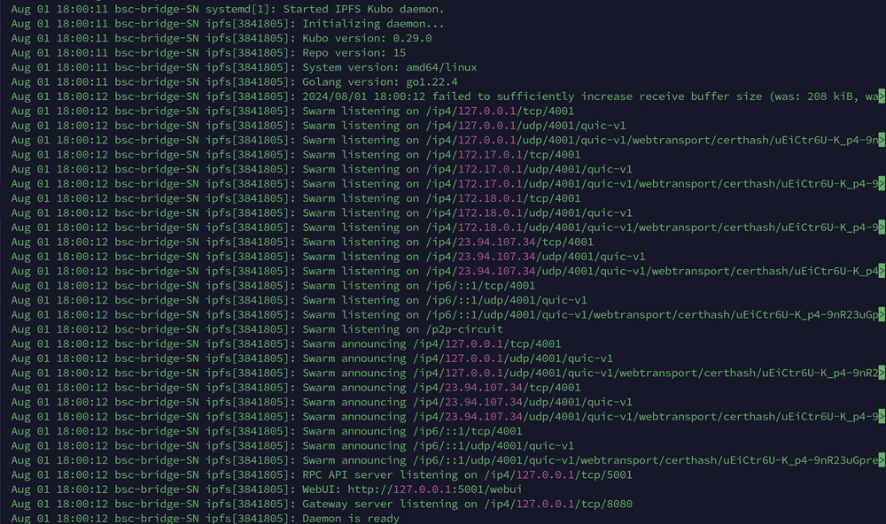
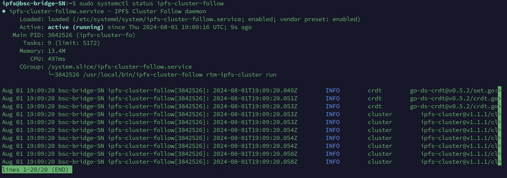

Join The IPFS Cluster

## Introduction

The Raptoreum core team maintains a collaborative IPFS cluster. This cluster allows for a decentralized and robust storage solution for files attached to digital assets.

The more community members who join the cluster the more robust and decentralized it becomes. This doc will show you how to join the cluster as a follower peer. Your node will replicate all pins from the cluster and serve them when requested, effectively becoming a part of the cluster. Pins are files which are made permanently available by the cluster, they never expire or are deleted.

Important:
Before proceeding send Charlie the IPv4 address of the server you plan on joining the cluster with. The IP needs to be whitelisted on the cluster before it can join. Send the IP on Discord in DM or to charlie@raptoreum.com

## Linux IPFS Setup
Ubuntu 20 was used for this section, you may need to adjust it slightly depending on your version of Linux. 4GB+ RAM, 2 CPU cores, and 50GB of SSD are suggested minimums. The storage requirements will most likely grow over time.

Tip: Increase the delay on being prompted for sudo password (default is 60 seconds):
```bash
sudo visudo
```

Add the following line:
```bash
Defaults    timestamp_timeout=60
```

Add a system user:
```bash
sudo adduser <name here>
```

Add user to sudo group and change to:
```bash
usermod -aG sudo <username>
su - username
```

Open Ports 9096 and 4001:
```bash
sudo ufw allow 9096
sudo ufw allow 4001
```

Download IPFS Kubo:
```bash
wget https://dist.ipfs.tech/kubo/v0.35.0/kubo_v0.35.0_linux-amd64.tar.gz
```

Note the above link may not be the latest version, check on https://dist.ipfs.tech/#kubo and adjust as needed.

Unpack The Files:
```bash
tar -xvzf kubo*
```

Run installer:
```bash
sudo ./install.sh
```

## Initialize IPFS:
```bash
ipfs init
```

## Configure IPFS For Raptoreum Private Cluster

The Raptoreum cluster is a private cluster with no communications with the public IPFS network. It is dedicated solely to Raptoreum assets. In order to join you need the swarm key.

```bash
nano ~/.ipfs/swarm.key
```

Add this:
```bash
/key/swarm/psk/1.0.0/
/base16/
ce0b1b53725410a404b1d4a0406ef0bfc9e402a0f249be603e8162be1b211c27
```

Now a change is needed in the IPFS config:
```bash
nano ~/.ipfs/config
```

Search for the routing section and add:
```bash
"Type": "dht",
```

Remove useless bootstrap peers and add ours:
```bash
ipfs bootstrap rm --all
ipfs bootstrap add /ip4/198.244.164.169/tcp/4001/p2p/12D3KooWKbNz8hNhijWU1Yi3jHC5fmMhVvNyBxgXNJGVRMzpxoMR
ipfs bootstrap add /ip4/51.89.21.112/tcp/4001/p2p/12D3KooWBe13StAvfeJxThQzGS6WDwFbTCytBPjoMYKcP1G6KCQ5
```

Add IPFS As A System Service:
```bash
sudo nano /etc/systemd/system/ipfs.service
```

Add this block:
```bash
[Unit]
Description=IPFS Kubo daemon
After=network.target

[Service]
User=yourusername
ExecStart=/usr/local/bin/ipfs daemon
Restart=on-failure

[Install]
WantedBy=multi-user.target
```
*Replace "yourusername" with your current username.

Reload Systemd, enable, and start IPFS:
```bash
sudo systemctl daemon-reload
sudo systemctl enable ipfs
sudo systemctl start ipfs
```

Check and make sure ipfs started up properly:
```bash
sudo journalctl -u ipfs.service
```

Here is an example of a good startup:


## Download and Install IPFS Cluster Follow:
```bash
wget https://dist.ipfs.tech/ipfs-cluster-follow/v1.1.4/ipfs-cluster-follow_v1.1.4_linux-amd64.tar.gz
tar -xvzf ipfs-cluster* && cd ipfs-cluster-follow
sudo mv ipfs-cluster-follow /usr/local/bin/
```

Join the Raptoreum Cluster:
```bash
ipfs-cluster-follow rtm-ipfs-cluster init https://bootstrap.raptoreum.com/ipfs/service.json
```

Add as a system service:
```bash
sudo nano /etc/systemd/system/ipfs-cluster-follow.service
```

Add this:
```bash
[Unit]
Description=IPFS Cluster Follow daemon
After=network.target

[Service]
User=yourusername
ExecStart=/usr/local/bin/ipfs-cluster-follow rtm-ipfs-cluster run
Restart=on-failure

[Install]
WantedBy=multi-user.target
```
*Replace "yourusername" with your current username.

Reload, enable, and start the cluster-follow service:
```bash
sudo systemctl daemon-reload
sudo systemctl enable ipfs-cluster-follow
sudo systemctl start ipfs-cluster-follow
```

## Check if Running
```bash
sudo systemctl status ipfs-cluster-follow
```


When you first start ipfs-cluster-follow it will pin everything from the cluster. It will continually check the cluster for new pins and add them. You can check and see what it has pinned with:
```bash
ipfs-cluster-follow rtm-ipfs-cluster list
```
This is what makes IPFS a great choice to store files attached to assets. A decentralized, highly available global network of peers working togetrher to make sure those files are always available.

## Monitoring and Updates
If you join the Raptoreum IPFS cluster (I hope you do), I suggest that you join our Discord and and occasionally check the #ipfs channel. There will be times that everybody needs to update IPFS and ipfs-cluster-follow versions to stay in sync.