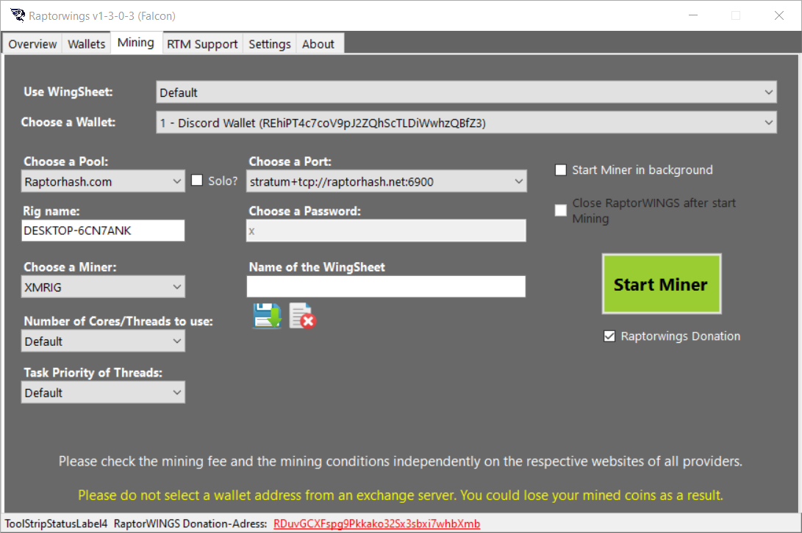

RaptorWings: Your Complete Raptoreum Dashboard and Mining Solution

## What is RaptorWings?
RaptorWings is a free, open-source GUI (Graphical User Interface) application designed to make Raptoreum mining and wallet management accessible to everyone. Whether you're a complete beginner or an experienced miner, RaptorWings provides an intuitive dashboard that eliminates the complexity typically associated with cryptocurrency mining and blockchain interaction.

Important: Since February 2026, Raptorwings 1 has only been usable to a limited extent and will be replaced by Raptorwings v2 in spring 2026.

## Key Features at a Glance

- Wallet Dashboard: Monitor your RTM wallet addresses, balances, and current market prices in real-time
- Local Mining Interface: Easy-to-use graphical interface for mining directly on your computer
- Privacy-Focused: No data collection - all your information stays on your device
- Official Raptoreum Software: Developed and maintained by the Raptoreum team

## Why RaptorWings?

The cryptocurrency ecosystem can be intimidating for newcomers. Traditional mining setups require command-line knowledge, configuration file editing, and understanding complex technical concepts. RaptorWings changes this by providing:

## For Beginners

- No Command Line Required: Everything is accessible through an easy-to-understand graphical interface
- Guided Setup: Step-by-step configuration makes getting started straightforward
- Visual Feedback: Real-time statistics and status updates keep you informed

## For Experienced Users

- Advanced Configuration: Access to detailed settings for optimization
- Flexible Mining Options: Support for both local and cloud-based deployments

## Getting Started with RaptorWings

### System Requirements

- Operating System: Windows 10/11 (64-bit)
- Storage: 100MB free disk space minimum
- Memory: 2GB RAM recommended
- Processor: Modern multi-core CPU for optimal mining performance
- Internet Connection: Required for wallet synchronization and mining pool connections

### Installation Process

- Download RaptorWings
    - Visit the official [RaptorWings GitHub Releases page](https://github.com/Raptor3um/RaptorWings/releases/latest)
    - Download the latest version for Windows
    - Verify the checksum for security (recommended)
- First Launch
    Extract the downloaded archive to your preferred location
    Run RaptorWings.exe as a normal user (Administrator rights not required)
    The application will create a data folder at C:\Users\<YourUsername>\AppData\Local\Raptorwings
- Initial Configuration
    On first launch, you'll be guided through basic setup
    The software will automatically detect your hardware capabilities
    You can configure wallet addresses and mining preferences

