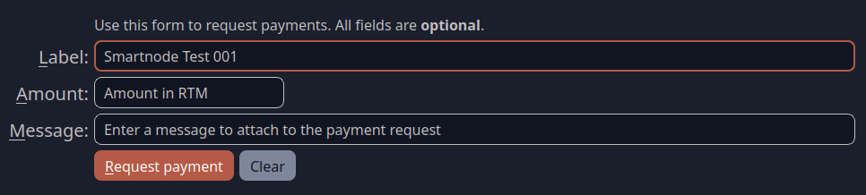
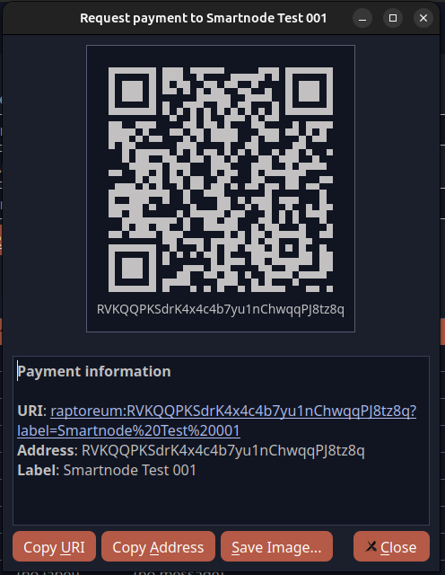
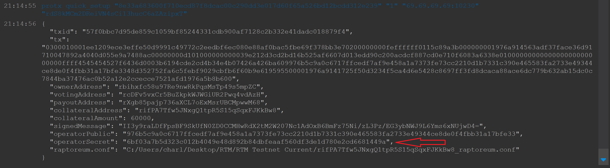

# Smartnodes Setup

There are different ways you can setup your Smartnode:

* Regular Setup: Setup as per this doc which has the option of a script or manual instructions at the bottom of this doc.
* dk808 Script: Does the majority of the VPS setup for you, has healthcheck, bootstrap, and add as a service. Only tested on Ubuntu 20.

## Smartnode Requirements
* A synchronized RTM Corewallet on your PC "at home"
* A VPS with a IPv4 (static) address. At least 1 CPU core, 2GB ram, and 75GB storage. Ubuntu 20 and 22 currently supported.
* 1.8 million RTM.
* A fully synced Raptoreumcore wallet.
* 30-60 minutes of your time.

## Important answers in advance
Since this question comes up frequently, we'd like to clarify a few things:

* Your core wallet "at home" can manage all your external smartnodes.
* Your RTM (at least 1.8 million) remains in your core wallet "at home". You don't need to transfer your RTM to the VPS wallet.
* You can manage multiple smartnodes from your core wallet "at home".

## IP-V4 Address
NOTE: Have your VPS and be logged into it before you start this setup. 
You also need to know the public ipV4 address. 
Your public IP address is the address of your server, which you use to log in to your VPS via PuTTY or SSH.
If you don't know this address, enter the following command on your VPS to obtain it:
```bash
curl -s ifconfig.me
```

## STEP 1: Collateral Wallet Setup ("at home")
Note: Make sure you have Raptoreumcore fully synchronized.

---

**1. Create a Smartnodes Address:**
Create a receiving address, labelling it is a good idea, for example Smartnode 01.

1. In QT Wallet, click on Receive Address in the left-hand menu.

2. Enter a unique name for the smartnode in the Label field. For example, Smartnode 001.

Note: You can leave Amount and Message blank.

3. Click on "Request payment"

4. Copy the RTM wallet address to a place where you can easily find it again.


---

**2. Send 1,8Million RTM:**

1. Send 1.8 million to the address you just created.

    Note: You can send 1.8 million RTM from one of your external addresses to this newly created "Smartnodes address", or internally in the core wallet "to yourself".

    Important: Send the 1.8 million in one transaction. Do not send 1 million, then 500,000 RTM, and then 300,000 RTM.

2. Wait until the 1.8 million RTM have arrived at your new address (2-5 minutes, depending on the block duration).

---

**3. Get Transaction ID**
Now go to your transaction page and right-click on the transaction you just completed. Note the transaction ID of the transaction you used to send the 1.8 million RTM.

This is the "collateral hash" we'll need shortly.

---

**4. Build The Protx Command**
Now we need to build the command (protx) that will register your smartnode on the network. 
It will also provide you with your BLS private key which you need for the smartnode setup.

1. Open the console in your Raptoreum QT CoreWallet via Window-> Console

2. We need this command:
    WARNING: Do not use this command; we will explain what you need to do:
    ```bash
    protx quick_setup "collateralHash" "collateralIndex" "ip:Port" "feeSourceAddress"
    ```

    * Collateral Hash: This is the transaction ID you recorded (Point 3).
    * Collateral Index: This will be "1".
    * ipandport: This is your VPS IP V4 Adress, port will be 10226, for example: 127.0.0.1:10226
    * Fee source address: This must be an RTM address containing a small RTM amount to cover the ProTX transaction.
    It must be an address on your wallet and **cannot be your Smartnodes address**.
    Find an address in your RTM core wallet to pay the fees (less than 1 RTM) and note/copy this address.

    Full protx quick_setup Command Example:
    ```bash
    protx quick_setup "8e33a683600f710ecd87f8dcac00c290dd3e017d60f65a526bd12bcdd312e239" "0" "69.420.420.69:10226" "rdS8kMCm2DReiVN4sCi13hucC6aZAzipxT"
    ```
    Note: Your transaction number, your IP address (VPS) and your payment address must be entered here.

---

**5. Enter the Protx Command**
Now that we have created the Protx command, we can enter it to obtain the BLS private key.

1. Now open your console in Raptoreum QT Core again via 
Window->Console
2. Enter the Protx command you created in step 4. 

    The statement should look something like this:

    

3. Record the operatorSecret, this is the BLS private key you need for your Smartnode VPS setup.

## STEP 2 (Option1): Smartnode VPS Setup (script) - on VPS
Charlie has created a script which takes care of the VPS setup, it will ask you a couple of question when you run it. If you are not sure answer "y". Have your BLS private key ready. 

1. Log in to your VPS via SSH in the console or with PuTTY.
2. (optional): You must be logged in as root to run the script. Some providers such as OVH provide a sudo user instead. To switch to root account do:   
```bash
sudo su
``` 
3. Run the Smartnode install script:
```bash
mkdir -p ~/SmartnodesInstallScript
```
```bash
cd ~/SmartnodesInstallScript
```
```bash
wget https://raw.githubusercontent.com/lorne-rtm/smartnode-installer/main/smartnode-installer.sh -O smartnode_setup.sh 
```
```bash
chmod +x smartnode_setup.sh
```
```bash
./smartnode_setup.sh

``` 
Note: If wget is not installed, enter the following command:
```bash
sudo apt update
```
```bash
sudo apt install wget
```
    <video width="100%" controls>
    <source src="https://learn.raptoreum.com/content/media/2024/07/Smartnode_Install_Script.mp4" type="video/mp4">
    Your browser does not support the video tag.
    </video>

## STEP 2 (Option2): Manual Smartnode VPS Setup - on VPS

You said you wanted to get your hands dirty...

**1. Log in to your VPS via SSH in the console or with PuTTY.**

---

**2. (optional):**

You must be logged in as root to run the script. Some providers such as OVH provide a sudo user instead. To switch to root account do:   
```bash
sudo su
``` 

---

**3. Update OS and install fail2ban**
```bash
apt update && apt upgrade -y
apt install fail2ban -y
``` 

---

**4. Check SWAP**
First check to make sure there is not already swap active:
```bash
free -h
```
    
If no swap it will return `Swap: 0B 0B 0B`

* Create SWAP, activate, and set sensitivity (swappiness):
        
    ```bash
    dd if=/dev/zero of=/swapfile bs=1k count=4096k
    chmod 600 /swapfile
    mkswap /swapfile
    swapon /swapfile
    echo "/swapfile       swap    swap    auto      0       0" | tee -a /etc/fstab
    sysctl -w vm.swappiness=10
    echo vm.swappiness = 10 | tee -a /etc/sysctl.conf
    ```

---

**5. Configure UFW**
    ```bash
    ufw default deny incoming
    ufw default allow outgoing
    ufw allow ssh
    ufw allow 10226/tcp
    ufw enable
    ```

---

**6. Configure fail2ban to protect SSH**

1. Edit jail.local:
    ```bash
    nano /etc/fail2ban/jail.local
    ```

2. Add this in the jail.local
    ```bash
    [sshd]
    enabled = true
    port = 22
    filter = sshd
    logpath = /var/log/auth.log
    maxretry = 3
    ```

3. Save and Exit Nano
    * Press `Ctrl` + `O` then `Enter` to **Save**.
    * Press `Ctrl` + `x` to Exit.

4. Restart fail2ban:
```bash
systemctl restart fail2ban
```

---

**7. Add a system user to run the Smartnode under**
```bash
adduser rtmuser
# Follow prompts to set password
usermod -aG sudo rtmuser
su - rtmuser
```

---

**8. Get bootstrap 
```bash
cd ~
mkdir -p .raptoreumcore && cd .raptoreumcore
wget -qO- https://bootstrap.raptoreum.com/bootstraps/bootstrap.tar.xz | tar -xzv
```

---

**9. Create raptoreum.conf**

Create the file ~/.raptoreumcore/.raptoreum.conf

1. Create the conf file
    ```bash
    cd ~
    mkdir -p .raptoreumcore/
    nano .raptoreumcore/.raptoreum.conf
    ```

2. Edit the Conf File:
Note: You Need:
    * YOUR VPS IP ADDRESS
    * an RPC USERNAME
    * an RPC PASSWORD
    * the smartnodeblsprivkey

    ```bash
    externalip=your_VPS_ip:10226
    rpcuser=replaceme
    rpcpassword=replaceme
    rpcallowip=127.0.0.1
    server=1
    dbcache=1024
    listen=1
    addnode=lbdn.raptoreum.com
    rpcport=8484
    daemon=1
    #smartnodeblsprivkey=
    ```
3. Save and Exit Nano

    * Press `Ctrl` + `O` then `Enter` to **Save**.
    * Press `Ctrl` + `x` to Exit.

---

**10. Get latest release**

1. Go to the website https://github.com/Raptor3um/raptoreum/releases/latest
2. Find the file that matches your Ubuntu system. Right-click on it and copy the link.
3. Create the Raptoreum Core Folder and download
    ```bash
    cd ~
    mkdir -p rtm-latest
    cd ~/rtm-latest
    wget <URL from STEP2>
    tar -xvf *.tar.gz
    ```

---

**11. Get lastes Bootstraps**

1. Go to https://bootstrap.raptoreum.com/
2. Copy the link of bootstrap.tar.xz
3. Create the Bootstrap Folder
    ```bash
    cd ~/rtm-latest
    mkdir -p bootstraps
    cd bootstraps
    wget https://bootstrap.raptoreum.com/bootstraps/bootstrap.tar.xz
    ```
4. Extract and Move Bootstrap data:
    Extract the files directly into the data directory to save time and space:
    ```bash
    tar -xvf bootstrap.tar.xz -C ~/.raptoreumcore
    ```
5. Final Cleanup:
    Check the content and ensure it is in the correct location:
    ```bash
    ls -la ~/.raptoreumcore
    ```

---

**12. Start raptoreumd**
    ```bash
    cd ~/rtm-latest
    ./raptoreumd
    ```

---

**13. Check the blockcount**

Wait until the Raptoreum daemon has synchronized. Depending on your device, processor, and memory usage, this can take several hours.

You can check the status using:
```bash
./raptoreum-cli getblockcount
```

If the block count matches the one in the Explorer Dashboard (https://explorer.raptoreum.com), you can proceed.

Don't worry, the daemon runs in the background; you can log out of the terminal at any time.

---

**14. Stop the Daemon**
    
Once your Raptoreum Core has synchronized, stop the Raptoreum Core Daemon.
```bash
~/rtm-latest/./raptoreum-cli stop
```

---

**15. Add BLS private key to your raptoreum.conf**

We now need your BLS private key (operatorSecret) from STEP 1.

1. Open the raptoreum.conf:
    ```bash
    nano ~/.raptoreumcore/raptoreum.conf
    ```

2. Delete the # at the start of smartnodeblsprivkey= and add the key after the = (no space).
    ```bash
    smartnodeblsprivkey=YOUR OPERATORSECRET
    ```
3. Save and Exit Nano

    * Press `Ctrl` + `O` then `Enter` to **Save**.
    * Press `Ctrl` + `x` to Exit.

---

**16. Start raptoreumd and check smartnode status copy and all 3 lines**

```bash
~/rtm-latest/./raptoreumd
sleep 20
~/rtm-latest/./raptoreum-cli smartnode status
```

If all went according to plan you should see "READY" "READY" for the return.

Your Smartnode is operational!