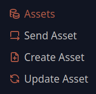
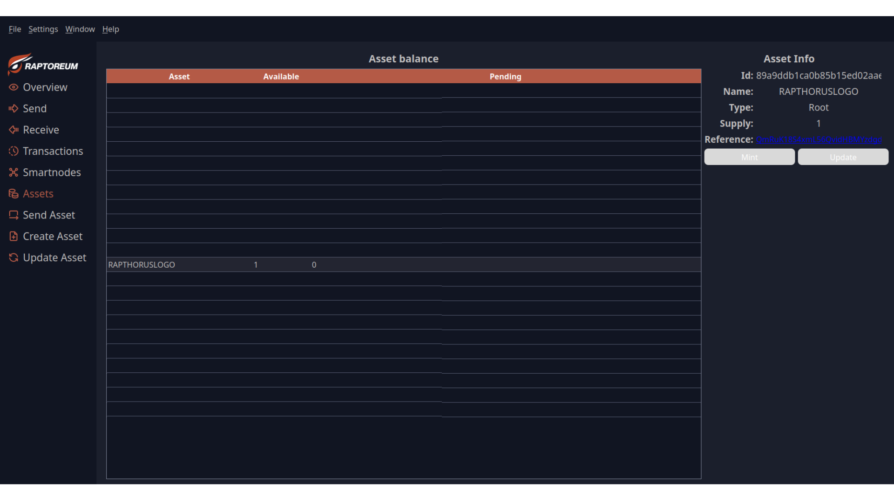
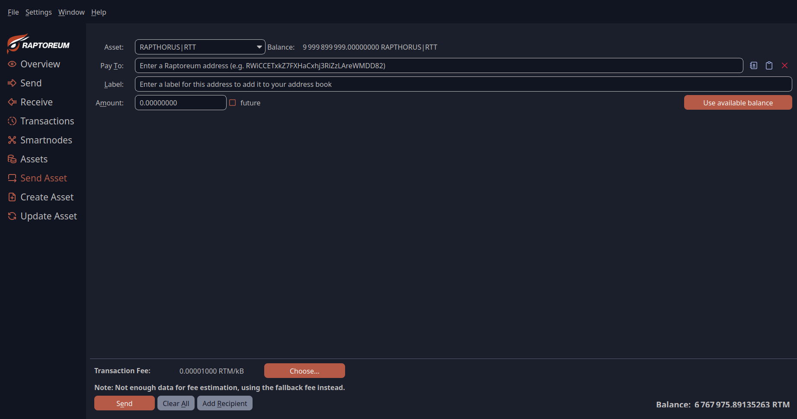
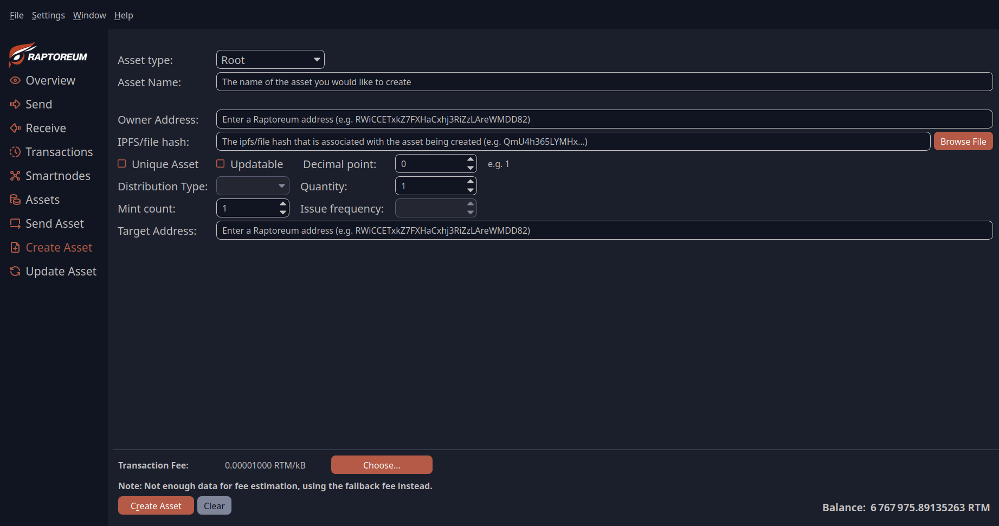

With Raptoreum Core QT, you can:

- Create assets
- Manage assets
- Send assets

In the main menu, you have the following options:

- Assets menu:
Here you can see the assets assigned to your wallet.

- Send Assets menu:
This menu is exclusively for sending assets.

- Create Assets menu:
This menu is exclusively for creating assets.

- Update Assets menu:
This menu is for updating assets.

## Menu Asstes (Overview)

This menu provides an overview of all assets in your wallet.

Here, depending on the asset's properties, you can:

- View the asset's properties
- Mint the asset
- Update the asset
- View the NFT image
- View the reference hash

This is simply an overview and management interface for your assets.

## Menu Send Assets

In this menu, you can send your assets, provided they are available in your wallet and you have some RTM (Real-Time Tokens) in your wallet as a fee.

- Asset: Here you select the asset you want to send. Next to the selected asset, you will see its balance in your wallet.
- Pay to: Enter the RTM wallet address to which you want to send the asset.
- Label: Here you can enter a name for the address so that it is automatically saved in your address book with a plain text label when sending.
- Amount: This is the amount of assets you want to send.
- Future: With this option, you can select when the asset should be sent in the future.

## Menu Create Assets
In this menu, you can create your assets.

There are many settings depending on the asset:

- Asset Type: Here you select whether to create a root or subasset.
- Asset Name: Enter the unique name of the asset here.
- Owner Address: Enter the owner's RTM wallet address here.
- IFPS/file hash: If you want to create a document as an NFT, you must upload it to the IFPS network via "Brose File". The hash returned by the network will be automatically written to this line.
- Unique Assets: If you want to create an NFT.
- Updateable: Here you select whether your asset can be updated later.
- Decimal Point: Here you select how many decimal places your asset should have. The options are 0-8. Also: 1.0 to 0.00000001
- Quantity: The number of asset quantities to be created
- Min Count: The number of mints that may be performed
- Target address: The destination address to which your asset is sent with each mint.

## Menu Update Asset
In this menu, you can update your assets, provided:

1. They are updateable
2. Your wallet address is the owner of the asset

You can adjust the following settings:

- Owner Address: Change the owner address of the asset
- IFPS/hash: Adjust the asset's document
- Updateable: You can change whether the asset is updateable
- Quantity: You can adjust the number of assets per mint
- Mint Count: You can adjust the maximum number of mints
- Target Address: You can select the address to which the asset should be sent when minted