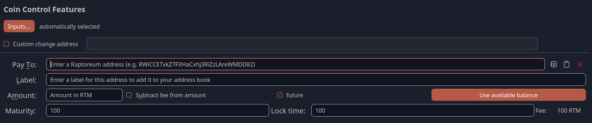

# QT Wallet Futures Transactions
To create a futures transaction in Raptoreum QT Core (desktop), do the following:

## Set up transaction
1. Open the Raptoreum QT wallet.
2. Wait until the wallet has synchronized.
3. Go to Send in the menu.

4. Enters the “classic” transaction data
5. Activate the “futures” option
6. Enter the time intervals
7. Click on Send

## Calculation example for futures
You can distinguish between maturity and lock time:

- Maturity (Block Count): The number of block confirmations required after the transaction is broadcast.
- Lock Time (Time): A specific duration or timestamp measured in seconds.

### Execution Logic: Maturity vs. Lock Time
In the Raptoreum network, you have two ways to schedule a Future Transaction. The network will execute the transaction as soon as either of these conditions is met.

The Scenario:

- Current Date: February 20, 2026, 10:41 AM.
- Target Date: March 1, 2026, 12:00 AM (Midnight).
- Time Difference: 8 days, 13 hours, and 19 minutes.
- Total Minutes: 12,319 minutes.

### Option 1: Using Maturity (Block Count)
This method relies on the progress of the blockchain. Since the target block time is 2 minutes, we calculate the number of blocks required to bridge the time gap.

The Calculation:

- Setting in Wallet: You enter 6160 in the Maturity field.
- Pros/Cons: If the network hashrate increases (blocks are found faster), the transaction might execute slightly before March 1st. If the hashrate drops, it might execute later.

### Option 2: Using Lock Time (Seconds)
This method uses a fixed timer. It is independent of how many blocks are found and relies on the Unix timestamp or a relative delay in seconds.

The Calculation:

- Setting in Wallet: You enter 739140 in the Lock Time field.
- Pros/Cons: This is precise according to the clock. However, the transaction still needs a block to be included in, so it will execute in the first block found after this time has elapsed.