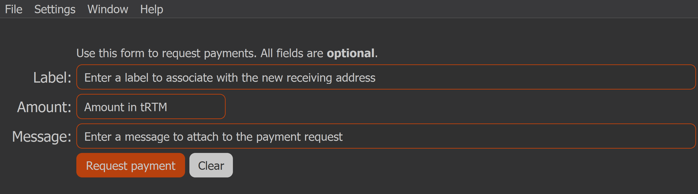
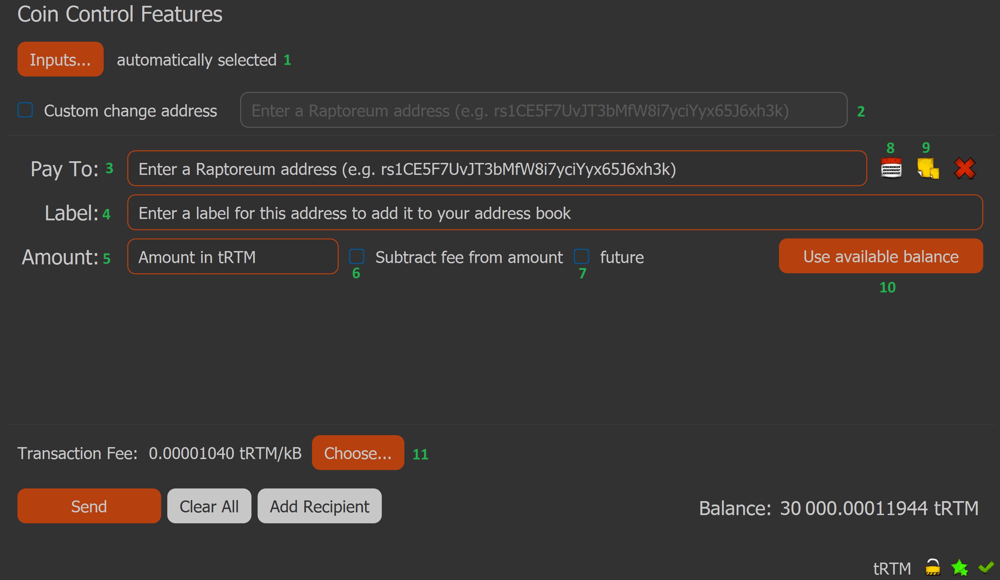

# Raptoreum Core QT (Desktop Version)

## Understanding the QT Wallet
The QT Wallet (also known as the Core Wallet) is the official software for managing Raptoreum (RTM) on a desktop computer. It is a "Full Node" client, meaning it downloads and verifies the entire history of the Raptoreum blockchain. The QT Wallet is the graphical version of our core wallet.

## Navigation

In order to see most commonly used features move your mouse to the left hand side of the GUI, a menu will appear.
Encrypting Your Wallet

## Encrypting your wallet 

should be your first step. Go to Settings > Encrypt Wallet (encrypts your wallet.dat file). Make sure you record your password somewhere safe, offline is recommended. If you lose your password you will lose the RTM in that specific wallet.

## Receiving RTM

In order to receive RTM you need to create a receiving address, click on "Receive". None of these fields are required, they are used when creating a payment request (explained below).

* Label: This helps you identify this address in the future and makes it easier to find.
* Amount: How many RTM to send.
* Message: This message will be displayed with payment request.

Click on "Request Payment" will trigger a window where you can copy your RTM address.

## Sending RTM
To send RTM, go to the “Send” section in the main menu of the QT Walle

1.     Coin Control (optional): You may or may not see this, it allows you to select specific inputs used for sending. Enabled in Settings > Options > Wallet.
2. Custom change address (optional): Set a specific address to receive unspent RTM from the transaction. If this is not set the wallet will create a new adddress automatically to receive the change.
3. Pay to: The RTM address you are sending to.
4. Label: Attaches a label to the address making it easier to find and also adds the address to your address book (8). If you enter this address in the future the label field will autofill.
5. Amount: Amount of RTM to send.
6. Subtract fee from amount: If selected fee will be subtracted from amount on send, otherwise fee comes from any other available funds.
7. Future: Selecting this will add a couple of new fields: 
* Maturity: Number of confirmations before the RTM can be spent.
* Lock Time: Time in seconds before the RTM can be spent.

    Note: If you use both Maturity and Lock Time whichever one ends first is used.

8. Address Book: Addresses which have a label added are automatically added here. You can also add addresses here manually.
9. Paste address from clipboard: Equivalent to ctrl+v or right click and paste.
10. Use available balance: Will autofill Amount field with all available funds.
    Transaction Fee: Choose how much to pay to send the transaction. In most cases leaving this to be determined by the wallet is fine. You can open this section and choose a quicker acceptance time in blocks. Depending on how busy the network is this may increase your fee, it also does not guarantee your transaction is accepted in X blocks.

## Backups

Each time you open or load a wallet the system creates an automatic backup of the corresponding wallet.dat file in raptoreumcore/backups. You should also make a habit of backing up all of your wallet.dat files, see locations. To do this close your wallet and copy all walle.dat files to another location. You should keep a copy offline, such as a USB stick.