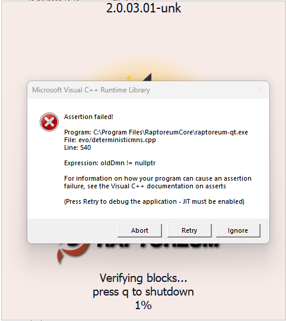

# Raptoreum Core troubleshooting

## QT Wallet error

### Assertion failed: oldDmn != nullptr

The error Expression: oldDmn != nullptr indicates that the local blockchain database (in particular, the data on deterministic master nodes, or “DMN” for short) is corrupted or does not match the current status of the chain.

Troubleshooting:

1. Copy the current bootstraps into your project

    [Using Bootstraps](../bootstraps.md) (intern Link)

2. Reindex:

    Option1:
    Restart Raptoreum QT Wallet and confirm that a reindex should be performed.

    Option2:
    Start Raptoreumd with the command `raptoreumd.exe --reindex` in the console and wait until everything is synchronized.

